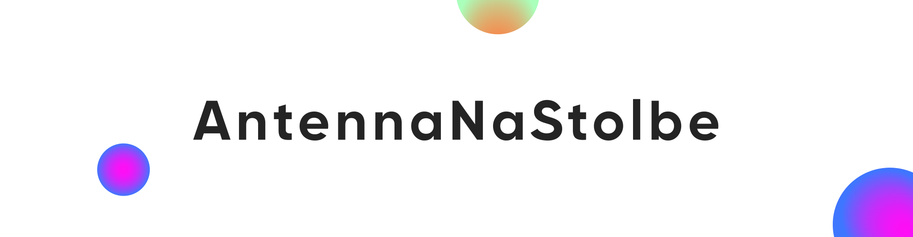

<h3 align="center">Tester, a bit of a designer, and a Smart Home enthusiast</h3>
<h3 align="center">👨‍💻 QA Engineer with experience in manual testing.</h3>
<h3 align="center">🎨 Passionate about UI/UX design and creating user-friendly interfaces.</h3>
<h3 align="center">🏠 Currently exploring and working on Smart Home technologies and automation.</h3>
<h3 align="center">🔧 Always learning and exploring new tools and technologies.</h3>
<h3 align="center">💡 Open to collaboration on interesting projects!</h3>

 
 

  
<h2><b>⭐GitHub stats⭐</b></h2>

  

     
    
   
    
   
  

